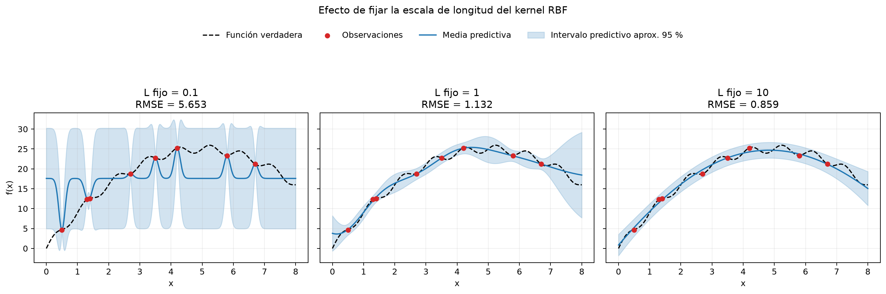

# Gaussian Process Regression

[](https://github.com/RansiJ/gaussian-process-regression/actions/workflows/ci.yml)

Proyecto sintético y reproducible que muestra regresión con procesos gaussianos
(GP), incertidumbre predictiva y el papel de la escala de longitud del kernel
RBF. La función generadora es conocida, por lo que la media predictiva puede
evaluarse directamente mediante RMSE y MAE.

En este contexto, un Gaussian Process define una distribución sobre posibles
funciones de regresión: produce una media predictiva y cuantifica la dispersión
de las predicciones en cada punto del dominio.



## Experimentos

El primer experimento fija realmente `length_scale` en 0.1, 1.0 y 10.0 mediante
`length_scale_bounds="fixed"`. En cada caso se optimizan únicamente la amplitud
del kernel y el nivel de ruido, por lo que la comparación representa realmente
tres escalas de longitud distintas.

El segundo experimento ajusta un único kernel
`ConstantKernel * RBF + WhiteKernel`. Amplitud, escala de longitud y ruido se
seleccionan maximizando la log-verosimilitud marginal, con reinicios y semilla
reproducibles.

## Resultados principales

| Modelo | RMSE | MAE | Log-verosimilitud marginal |
|---|---:|---:|---:|
| L fijo = 0.1 | 5.6525 | 4.3683 | -10.8907 |
| L fijo = 1.0 | 1.1321 | 0.8916 | -6.8973 |
| L fijo = 10.0 | **0.8589** | **0.7068** | -6.7136 |
| L optimizado = 4.1777 | 0.9234 | 0.7840 | **-5.3969** |

En este conjunto pequeño, `L=10` aproxima mejor la función verdadera sobre la
malla densa, mientras que el modelo optimizado obtiene la mejor
log-verosimilitud marginal sobre las ocho observaciones. Los criterios no tienen
por qué seleccionar el mismo modelo: el optimizador no conoce los valores de la
función fuera de los puntos observados.

El modelo optimizado aprende una desviación de ruido equivalente a 1.0246 en las
unidades originales, mayor que el ruido generador de 0.1. Con tan pocos puntos,
el GP suave puede atribuir al ruido parte de la oscilación no resuelta; esta
estimación no debe interpretarse como una recuperación precisa del ruido real.

Las bandas mostradas son intervalos predictivos aproximados del 95 %. Como el
kernel contiene `WhiteKernel`, incluyen el componente de ruido de observación y
no representan exclusivamente incertidumbre sobre la función latente.

## Ejecución

Desde la raíz del proyecto:

```bash
python -m venv .venv
```

Active el entorno (`.venv\Scripts\Activate.ps1` en PowerShell o
`source .venv/bin/activate` en macOS/Linux) y ejecute:

```bash
python -m pip install -r requirements.txt
jupyter lab notebooks/gaussian_process_regression.ipynb
```

Ejecute todas las celdas en orden. El notebook vuelve a generar las figuras en
`figures/` y usa una semilla fija para datos y optimización.

## Estructura

```text
gaussian-process-regression/
├── figures/
│   ├── fixed_length_scales.png
│   └── optimized_gp.png
├── notebooks/
│   └── gaussian_process_regression.ipynb
├── README.md
└── requirements.txt
```

## Dependencias

- NumPy
- Matplotlib
- scikit-learn
- Jupyter

Este ejercicio está limitado a una función sintética, ocho observaciones y un
kernel RBF. Su objetivo es demostrar los conceptos con claridad, no representar
una aplicación industrial ni una comparación exhaustiva de modelos. Las métricas
dependen de la semilla, los puntos observados y la malla de evaluación elegidos.

## Licencia

El código, notebook, documentación y figuras sintéticas se publican bajo la
[licencia MIT](LICENSE).
